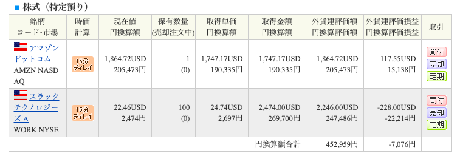
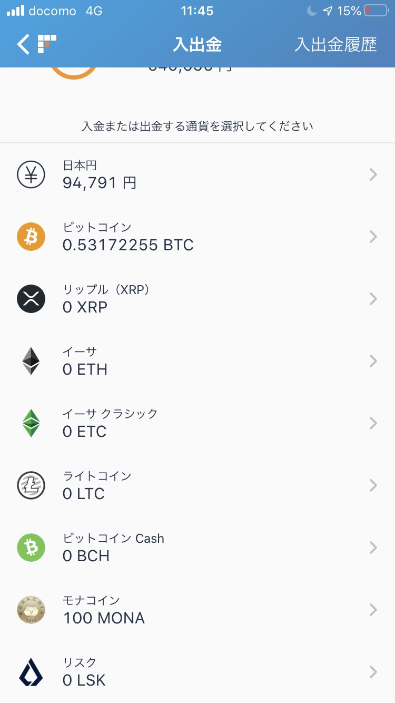

# About
プログラミングを教えるためにイタリアから日本にやってきました。 
パスタとプログラミングを愛しています。

## Profile
- 折原ダビデ竜（D_drAAgon）
- 東京都
- プログラミング、サーバー構築

# Skills
- GitHub Pages
- markdown
- HTML
- Javascript（Canvas）、Node.js（Express・Webpack）、PHP

# Works
- [GitHub](https://github.com/DDRAGON)
- 作った作品
  - [N予備校フォーラムランキング](https://progedu.github.io/forum-ranking/)
  - [Web アプリケーションコンテスト2019冬](https://progedu.github.io/web-contests/webcontest2019-winter/)
- 折原先生の躍動
<iframe src="https://www.openprocessing.org/sketch/825168/embed/" width="600" height="450"></iframe>

# Contact
- [Twitter](https://twitter.com/D_drAAgon)
- [インスタグラム](aaaaa)
- davideryu_orihara@dwango.co.jp

# 折原ダビデ竜に100円あげる。

https://buy.stripe.com/cN28Ak4CQ5j52as288 
こちらから100円を折原ダビデ竜にプレゼントすると、そのうちの 1.5% は世界の炭素削減の団体に寄付されます。 
（残りはスタッフが美味しくいただきます。）

# 金融商品
アメリカ株

ビットコイン

<a class="twitter-timeline" data-width="400" data-height="600" data-theme="dark" href="https://twitter.com/D_drAAgon?ref_src=twsrc%5Etfw">Tweets by D_drAAgon</a> 

<blockquote class="twitter-tweet">
N予備校でぇ！プログラミングを学んでぇ！！実際にぃ！ IT企業内定をキメたぁー！！！ 方々の声がぁ！載ったぁーー！！！！<a href="https://t.co/ERGjOHulOY">https://t.co/ERGjOHulOY</a> 実績も出しているN予備校のプログラミングすごい！本当にすごいんだ！<a href="https://twitter.com/hashtag/N%E4%BA%88%E5%82%99%E6%A0%A1?src=hash&amp;ref_src=twsrc%5Etfw">#N予備校</a> <a href="https://twitter.com/hashtag/%E3%83%97%E3%83%AD%E3%82%B0%E3%83%A9%E3%83%9F%E3%83%B3%E3%82%B0?src=hash&amp;ref_src=twsrc%5Etfw">#プログラミング</a> <a href="https://t.co/UEblIVaomW">pic.twitter.com/UEblIVaomW</a>
&mdash; D_drAAgon (@D_drAAgon) <a href="https://twitter.com/D_drAAgon/status/1177158124899225600?ref_src=twsrc%5Etfw">September 26, 2019</a></blockquote> 

# History
- 2013年ドワンゴ入社
- 2020年バーチャルに先生と授業

